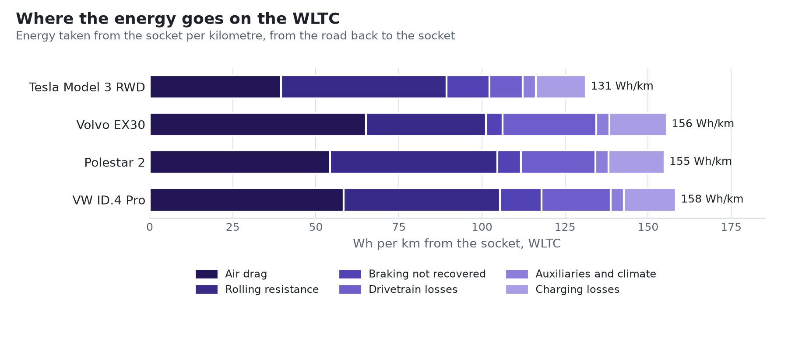
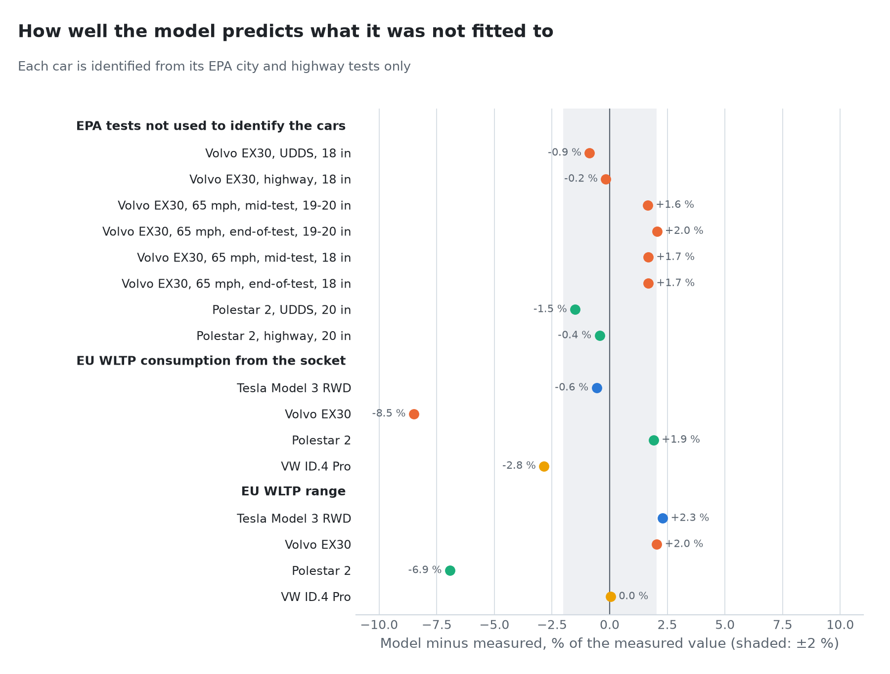
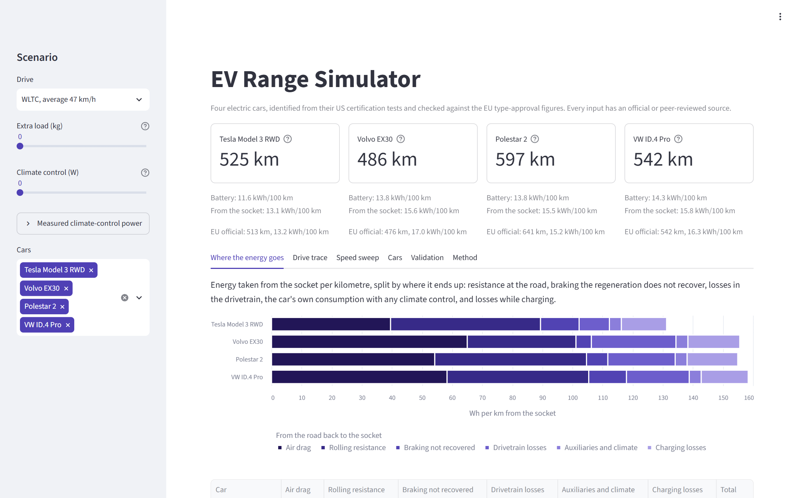
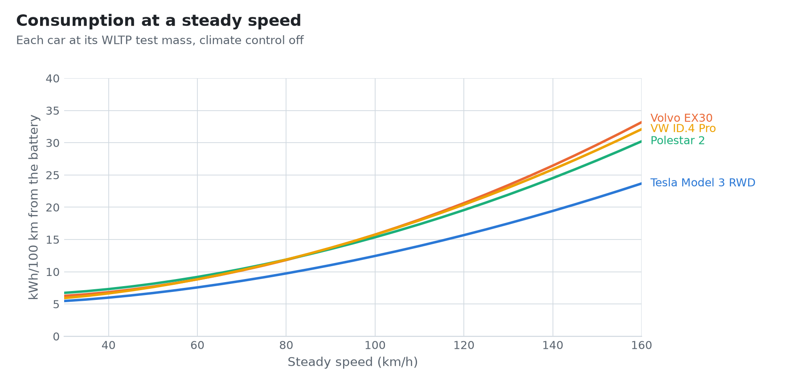

# EV Range Simulator

[](https://github.com/zero705/ev-range-simulator/actions/workflows/ci.yml)


How much energy does an electric car need, and how far does it go? This project answers that
for four cars sold in both Europe and the US, the **Tesla Model 3 RWD, Volvo EX30, Polestar 2
and Volkswagen ID.4 Pro**, with a physics model built only from official measurements and
regulatory definitions. Each car's drivetrain is identified from its US EPA certification test,
then checked, without any further tuning, against the EU type-approval (WLTP) figures and,
where the EPA reports contain them, against EPA tests the identification never saw. A
Streamlit app lets you drive the cars through the standard test cycles or at a steady speed,
with extra load and climate control.

<picture>
  <source media="(prefers-color-scheme: dark)" srcset="docs/images/breakdown-dark.png">
  
</picture>

*Energy taken from the socket per kilometre on the WLTC, split by where it ends up. Drawn by
`tools/make_figures.py` from the model.*

## What it answers

- *How much energy does each car take from its battery, and from the socket, on the EU and US
  test cycles, or at a steady 130 km/h?*
- *Where does it go: air drag, rolling resistance, braking, drivetrain losses, the car's own
  consumption, charging?*
- *How far does each car get with passengers on board, or with the heating on?*
- *How well does a model identified from US tests predict the EU official figures?*

## Results

<!-- generated: summary -->
| Car | WLTP consumption, official / model | WLTP range, official / model | Unused EPA tests, largest difference |
|---|---|---|---|
| Tesla Model 3 RWD | 132 / 131 Wh/km (-0.6 %) | 513 / 525 km (+2.3 %) | none |
| Volvo EX30 | 170 / 156 Wh/km (-8.5 %) | 476 / 486 km (+2.0 %) | 2.0 % (6 tests) |
| Polestar 2 | 152 / 155 Wh/km (+1.9 %) | 641 / 597 km (-6.9 %) | 1.5 % (2 tests) |
| VW ID.4 Pro | 163 / 158 Wh/km (-2.8 %) | 542 / 542 km (0.0 %) | none |
<!-- end generated -->

<!-- generated: findings -->
- Each car's model is identified from its two US certification cycles alone. The EPA reports of the Volvo EX30 and Polestar 2 contain 8 further measurements (other wheels, a steady 65 mph); the largest difference between model and measurement is 2.0 %.
- For the Tesla Model 3 RWD and VW ID.4 Pro the model matches the EU official consumption and range within 3 %.
- For the other cars the two EU comparisons disagree with each other (Volvo EX30: consumption -8.5 %, range +2.0 %; Polestar 2: consumption +1.9 %, range -6.9 %). Both start from the same modelled battery consumption and differ only in the charging efficiency and usable battery energy carried over from the US tests, so what separates them lies there; the EU figures imply other values than the EPA measured ([method, section 5.3](docs/method.md#53-what-the-eu-figures-imply-about-charging)). The gaps are reported, not tuned away.
<!-- end generated -->

<picture>
  <source media="(prefers-color-scheme: dark)" srcset="docs/images/validation-dark.png">
  
</picture>

**How accurate it is.** Against the official measurements of these cars that the model was
not fitted to:

<!-- generated: accuracy -->
| Compared with | Values | Mean difference | Largest difference | Within 3 % |
|---|---|---|---|---|
| EPA tests the identification did not use | 8 | 1.3 % | 2.0 % | 8 of 8 |
| EU WLTP consumption and range | 8 | 3.1 % | 8.5 % | 6 of 8 |
| All of them | 16 | 2.2 % | 8.5 % | 14 of 16 |
<!-- end generated -->

These are laboratory tests of the real cars under standard conditions. The model has not been
checked against driving on public roads: no measured on-road data for these cars were found
in an official or peer-reviewed source. On the road, weather, speed, traffic, slopes and wind
change consumption; the app takes speed, load and climate-control power into account, but
not the rest (see [Limitations](#limitations)).

**Range by drive.** Modelled range in km, each car at its WLTP test mass with the climate
control off: the usable battery energy the EPA measured, divided by the modelled battery
consumption.

<!-- generated: ranges -->
| Car | WLTC | UDDS (city) | HWFET (highway) | 100 km/h | 130 km/h |
|---|---|---|---|---|---|
| Tesla Model 3 RWD | 525 | 654 | 581 | 490 | 349 |
| Volvo EX30 | 486 | 650 | 532 | 426 | 287 |
| Polestar 2 | 597 | 767 | 650 | 537 | 375 |
| VW ID.4 Pro | 542 | 709 | 602 | 492 | 336 |
<!-- end generated -->

## The app



Choose a drive (the WLTC or one of its phases, the EPA city or highway cycle, or a steady
speed), add load and climate-control power, and compare the cars: range, consumption from the
battery and from the socket, where the energy goes, and how consumption and range change with
speed. The cars tab lists every input the model uses for each car, with its source and a link
to the car's EPA certificate; the validation tab lists every comparison with official data; and
the climate-control panel shows the heating and cooling power Argonne National Laboratory
measured on two cars at a standstill.

```bash
git clone https://github.com/zero705/ev-range-simulator.git
cd ev-range-simulator
pip install -e ".[app]"
streamlit run streamlit_app.py
```

## How it works

1. **Work at the wheels.** The force is the road load the EPA measured by coastdown, plus
   inertia. Speed traces are sampled once per second; over each second the car moves at the
   mean of the two samples and accelerates at their difference, so over a cycle that starts and
   ends at rest the inertial work cancels exactly and the net work is the road-load work.
2. **Battery and socket.** Energy from the battery is the work the wheels deliver divided by
   the drivetrain efficiency, minus the share of braking work regeneration returns, plus the
   car's own consumption; energy from the socket divides that by the charging efficiency.
3. **Identification.** Each car's drivetrain efficiency and regeneration coefficient solve two
   equations: its battery consumption on the EPA city and highway cycles, measured on a
   dynamometer set to the same road load. Its charging efficiency comes from the same EPA
   certificate. The car's own consumption, 185 W, is the mean of two measurements by Argonne
   National Laboratory.
4. **Validation.** Everything the identification did not use: other wheel options and a
   steady 65 mph in the EPA reports, and the EU WLTP consumption and range.

The equations, every check and the sensitivity to each modelling choice are in
[docs/method.md](docs/method.md).

<picture>
  <source media="(prefers-color-scheme: dark)" srcset="docs/images/speed-dark.png">
  
</picture>

## Where the numbers come from

| Input | Source | How it was checked |
|---|---|---|
| Drive cycles | UN GTR No. 15 (WLTC); 40 CFR Parts 86 and 600 (UDDS, HWFET) | every second compared with the tables in the regulations |
| Road load | US EPA Test Car List | exact unit conversions; the same test vehicles as the certificates |
| Battery and socket energy | US EPA certificate summaries | each certified range reproduced from the stated energies |
| Masses, official consumption and range | EEA, EU registrations 2024 | the values most registrations carry; cross-checked with manufacturer documents |
| The car's own consumption, climate power | US DOE program record, 2024 (Argonne) | verbatim quotes found in the document |
| Reference air, masses, rotating mass, unit conversions | UN GTR No. 15; Regulation (EU) 2017/1151; 40 CFR 86.129-00 and 1066.305; NIST SP 811 | verbatim quotes found in the documents; the tests tie the model's constants to them |

The data are read by scripts from the official files, and every other value taken from a
document carries a verbatim quote, or the spreadsheet cell it came from, that a script finds in
the fingerprinted (SHA-256) document. The full account, including a printing error found in one
EPA certificate and four misprinted time labels in the drive-cycle tables of the eCFR, is in
[docs/data-sources.md](docs/data-sources.md).

## Python API

<!-- generated: example -->
```python
from evrange import Conditions, load_study

study = load_study()
wltc = study.on_cycle("tesla-model3-rwd", "wltc")
print(round(wltc.battery_wh_per_km, 1), round(study.range_km("tesla-model3-rwd", wltc)))
# 116.2 525

# 130 km/h with 150 kg on board and 2 kW of heating
winter = study.at_speed("tesla-model3-rwd", 130, Conditions(extra_mass_kg=150, climate_w=2000))
print(round(study.range_km("tesla-model3-rwd", winter)))
# 312
```
<!-- end generated -->

## Limitations

- **One efficiency per car.** The two identified parameters reproduce the EPA city and highway
  tests exactly and unseen tests within about 2 %; well outside those conditions the model has
  not been tested.
- **Weather.** Climate-control power is the only weather input. Cold batteries also deliver
  less energy, which is not modelled, so cold-weather ranges are optimistic.
- **Road load.** The EU road loads are not public, so the EPA coastdown is used for both
  regions.
- **Charging.** The charging efficiency was measured in the US with recharges at 208-240 V.
- **Flat road, no wind.**

## Project structure

```
src/evrange/        the model: cycles, vehicles, physics, calibration, validation, reports
streamlit_app.py    the app
data/               verified data: cycles, vehicles, EPA certificates, reference values
tools/              scripts that build and verify the data and draw the figures
docs/               method, data sources and figures
tests/              pytest suite, including the app
.github/            CI, CodeQL and Dependabot
```

## Development

```bash
pip install -e ".[dev]"
pytest --cov                              # 100 % coverage of the package
ruff check . && ruff format --check . && mypy
python tools/update_docs.py --check       # README and method tables match the model
python tools/check_cycles.py              # drive cycles against the regulations' figures
python tools/verify_cycles.py --download  # drive cycles second by second against the regulations
python tools/epa_certification.py --download   # re-read the EPA certificates
streamlit run streamlit_app.py --client.showErrorDetails=full   # the app, with error details
```

The source documents are not in the repository, as several are copyrighted; `data/*.json` and
the tools record each one's URL and SHA-256, and `tools/verify_references.py` and
`tools/verify_manufacturer.py` check every quote once the documents are downloaded.
`python tools/verify_all.py` runs every one of these checks and summarises them. How the app
and the tools are protected, and how to report a security problem: [SECURITY.md](SECURITY.md).

## Data licences and citation

- **EU registrations.** European Environment Agency, *Monitoring of CO2 emissions from
  passenger cars, 2024 - Final*, CC BY 4.0, copyright holder the European Commission's
  Directorate-General for Climate Action. <https://doi.org/10.2909/5018ec17-2348-4c92-8761-6f2377bbd1c0>
- **Road load and certification data.** US Environmental Protection Agency, Test Car List and
  certificate summaries.
- **Regulations and drive cycles.** UNECE, GTR No. 15; Commission Regulation (EU) 2017/1151;
  US 40 CFR Parts 86, 600 and 1066. The WLTC's machine-readable copy is from the European
  Commission JRC `wltp` project (EUPL-1.1).
- **Unit conversions.** NIST Special Publication 811, *Guide for the Use of the International
  System of Units (SI)*, 2008 edition.
- **Reference values.** US Department of Energy, program record of 12 September 2024 and
  fueleconomy.gov; Sevdari et al., DTU dataset, CC BY 4.0,
  <https://doi.org/10.11583/DTU.25425262.v1>; Reick et al., *Vehicles* 3 (2021) 736-748, and
  Rosenberger et al., *World Electric Vehicle Journal* 15 (2024) 268, both CC BY 4.0.

## Author

Ömer Faruk Şenol, Hybrid and Electric Vehicles Technology, İnönü University

[GitHub](https://github.com/zero705) ·
[LinkedIn](https://www.linkedin.com/in/%C3%B6mer-faruk-%C5%9Fenol-2778a63b5/)

## License

[MIT](LICENSE)
